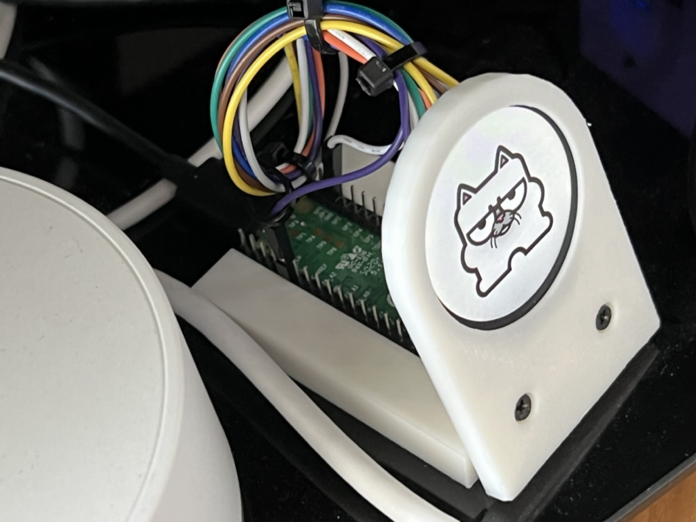

# tty2pico for Arduino

tty2pico is an addon project for the [MiSTer FPGA](https://github.com/MiSTer-devel) which displays full color text, graphics or animations based on the active MiSTer core. It was inspired by, and strives for command compatibility with, the original [tty2oled](https://github.com/venice1200/MiSTer_tty2oled) project.

<br>

## Features

* Displays PNG, static GIF, and animated GIF files all with transparency!
* Tuned for performance - animations can play up to 50fps or more!
* Can display files from built-in flash or microSD card if available
* Support for SPI displays up to 320x240 resolution (may require advanced setup)
* Appears as USB Mass Storage device so you can maintain your files
* Targets compatiblity with the [tty2oled Command List](https://github.com/venice1200/MiSTer_tty2oled/wiki/Command_v2)

## Requirements

tty2pico releases target the following hardware:

* Raspberry Pi Pico or other pin-compatbile RP2040 board
* 1.28inch Round 240x240 GC9A01 LCD Module
* Optional SPI microSD reader and card

The [RoundyPi](https://github.com/sbcshop/RoundyPi) module combines all three pieces of hardware on a single board, and is the recommended hardware to use for your installation.

Several other board and display configurations are available for advanced setups, which are detailed in the [Hardware](https://github.com/neil-morrison44/MiSTer_tty2pico/wiki/Hardware) section of the Wiki.

## Quick Start

The quick start instructions assume the use of a RoundyPi, though most steps will be the same or very similar if using a Pico or another custom setup.

### Install Firmware

To install:

1. Download the `.uf2` for your setup from the releases.
2. Hold the `BOOT` (or `BOOTSEL` on a Pico) button while plugging in your device. A new drive will appear on your computer with the name `RPI-RP2`.
3. Copy the `.uf2` file to the `RPI-RP2` drive. This will upload the new firmware to the device.

That's it! tty2pico should display a startup screen with some system information. If running from flash, tty2pico will try to mount an existing flash partition first. This will preserve your data between firmware updates. If no FAT partition is present on the flash parition it will be automatically created and labeled `TTY2PICO` when mounted as a drive on a PC. If running from SD card make sure it's using exFAT format and you're set.

If you'd like to build a custom setup take a look at the [Hardware](https://github.com/neil-morrison44/MiSTer_tty2pico/wiki/Hardware) page for a list of supported hardware and the [Development](https://github.com/neil-morrison44/MiSTer_tty2pico/wiki/Development) page for project setup information.

### Load Images

tty2pico supports transparent PNG, GIF and animated GIF files. When looking for an image to load, tty2pico will search the `/logos/` folder of your storage device (flash or microSD). Loading images is simple since your tty2pico device will show up as a flash drive on your computer. Just copy the images into the `/logos/` folder and you're set!

The logos should be named the same as the core, for example `snes.png` for SNES. This is not case-sensitive. If you don't know what the core name should be you can ssh into the MiSTer and type:

```sh
$ screen /dev/ttyACM0
```

This will show you what the MiSTer is requesting for the core name, what file(s) were searched for, and possibly some error messages if a file wasn't located. Again the this is not case-sensitive, so a core name of `PSX` will match `psx.gif`.

For best results make sure your image files are the same resolution or smaller than the display. See the [Image Files](https://github.com/neil-morrison44/MiSTer_tty2pico/wiki/Image-Files) section of the wiki for image specifications and optimization tips.

### (Optional) Edit tty2pico Configuration

On initial boot, tty2pico will generate a `tty2pico.toml` config file at the root of your storage device if one doesn't exist. Here you can tweak some default system options and tune a couple performance aspects of your setup. Refer to the [Configuration](https://github.com/neil-morrison44/MiSTer_tty2pico/wiki/Configuration) wiki page for a complete list of options.

### MiSTer Setup

First follow installation instructions of <https://github.com/venice1200/MiSTer_tty2oled> to get the script running on your MiSTer.

tty2pico isn't fully compatible with tty2oled, so some features like `USBMODE` and script updates need to be disabled. Update these values in the .ini file:

* TTYDEV="/dev/ttyACM0"
* USBMODE="no"
* SCRIPT_UPDATE="no"
* TTY2OLED_UPDATE="no"

Finally plug in your tty2pico device and reboot the MiSTer to complete the setup.
