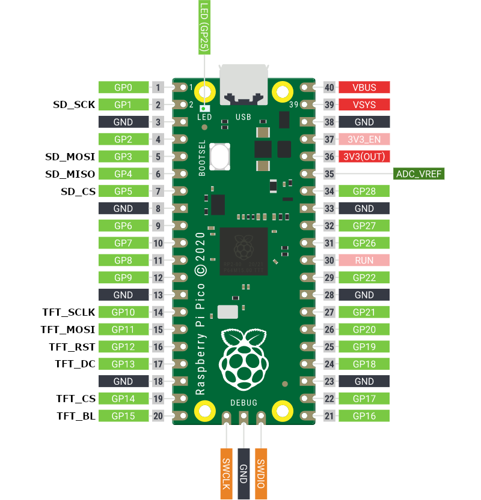

# tty2pico for Arduino

A full colour version of [tty2oled](https://github.com/venice1200/MiSTer_tty2oled) display addon for the [MiSTer FPGA](https://github.com/MiSTer-devel).

<br>

Features:

* Targets compatiblity with the [tty2oled Command List](https://github.com/venice1200/MiSTer_tty2oled/wiki/Command_v2)
* Displays PNG, static GIF, and animated GIF files all with transparency at up to 50fps!
* Can display files from built-in flash or microSD card if available
* Support for SPI displays up to 320x240 resolution (may require manual build)
* Appears as USB Mass Storage device so you can easily load new files

Table of Contents:
- [Installation](#installation)
	- [General](#general)
	- [Firmware](#firmware)
	- [Hardware](#hardware)
		- [Wiring](#wiring)
		- [MicroSD Cards](#microsd-cards)
		- [MicroSD Readers](#microsd-readers)
	- [Images](#images)
		- [PNG Files](#png-files)
		- [GIF Files](#gif-files)
	- [Configuration](#configuration)
- [Development](#development)
	- [Dependencies](#dependencies)
	- [PlatformIO Configuration](#platformio-configuration)
		- [Boards](#boards)
		- [Displays](#displays)
- [Command List](#command-list)
	- [tty2oled Commands](#tty2oled-commands)
	- [tty2pico Commands](#tty2pico-commands)
- [Roadmap](#roadmap)
	- [TODO](#todo)
	- [Refactoring and Optimizations](#refactoring-and-optimizations)

## Installation

### General

In order to achieve the maximum performance the RP2040 chip is overclocked to a rate of 266MHz, which is more than double the stock speed and the maximum safe speed to run without needing to adjust timings on critical system components like the flash memory. This effectively doubles the peformance of processing and pushing pixels to the display. The increased heat from the speed and voltage increases is minimal, so none or minimal passive cooling should suffice. We haven't come across any short-term issues or damage to the boards due to overclocking, however it's something to keep in mind for long-term installations and use.

### Firmware

Each RP2040 board and display combination requires its own build since a lot of the pin and bus configuration must be passed in at compile time. The mainline release targets the following hardware:

* Raspberry Pi Pico or equivalent generic board
* GC9A01 240x240 1.28inch IPS LCD Module
* Optional SPI microSD reader

The [RoundyPi](https://github.com/sbcshop/RoundyPi) module combines all three pieces of hardware on a single board, and is the recommended hardware to get started.

To install:

1. Download the `.uf2` for your setup from the releases, or [build your own using PlatformIO](#development).
1. Hold the `BOOLSEL` (sometimes just labeled `BOOT`) button while plugging in your device. A new drive will appear on your computer with the name `RPI-RP2`.
1. Copy the `.uf2` file to the `RPI-RP2` drive. This will upload the new firmware to the device.

That's it! tty2pico should display a startup screen. If running from flash, tty2pico will try to mount an existing flash partition first. This will preserve your data between firmware updates. If no FAT partition is present on the flash parition, it will be automatically formatted and labeled `TTY2PICO` when mounted as a drive on a PC. If running from SD card make sure it's already formatted as exFAT and you'll be set.

### Hardware

#### Wiring

<p align="center"></p>

This is a pin mapping for the Raspberry Pi Pico and pin-compatible clones. Connect your display to the corresponding `TFT_` pins and your optional SD reader to the corresponding `SD_` pins. You will of course also need to connect to the necessary power pin(s) for your devices. For the GC9A01, that would be the `3V3(OUT)` pin in the image. An ILI9341 display will want 5v power, so that would be better connected to the `VBUS` or `VSYS` pins.

If you have an external SD reader, you will need to hook it up to the `3V3(OUT)` pin, possibly sharing it with the display.

If you're using a RoundyPi you don't have to worry about any of this 😁

#### MicroSD Cards

microSD cards up to 128GB have been tested to work, though larger likely will as well. The recommended and supported file system format for SD is exFAT. This will allow near instant loading of the tty2pico device as USB Mass Storage, which then allows the rest of the tty2pico application to run smoothly.

Using FAT32 from microSD does work, however it's not a supported format. The cluster size must be very large when formatting the card to ensure as little delay as possible when processing the 10's of thousands of SD reads it takes to mount a FAT volume, which the data transfer rate from SD will bottleneck. An 8GB card was tested by formatting as FAT32 with 32k cluster size and it worked "OK", as in took several seconds to show as a drive on the computer but overall worked fine.

#### MicroSD Readers

tty2pico supports SD readers via the SPI interface that support "full speed", which is typically around 24MHz. A good portion of the external readers out there will support this frequency.

The integrated SD readers of the RoundyPi and the SparkFun Thing Plus RP2040 have been tested to work at a higher speed we'll call OC mode (overclock mode) which will put them around the 44MHz mark. The external SD readers from Adafruit and Sparkfun are known to run at this higher speed as well.

The microSD SPI speed is displayed on the tty2pico startup screen and when then `CMDSHSYSHW` command is executed.

> WARNING: Setting the SPI rate for your microSD reader too high can cause corruption to the SD card. Only use the higher rate OC mode with known working hardware, or you're willing to reformat your card to see if it will work.

### Images

tty2pico supports displaying transparent PNG, static GIF and animated GIF images from the `/logos/` folder of your storage device. For all image types, the images should be the same resolution or smaller than the display size to ensure proper output.

If an image is smaller than the display, the image will be automatically centered and the top-left pixel of the image will be used to fill the space. If that top-left pixel is transparent, that transparency is used and then blended with the configured background color (defaults to black) instead.

#### PNG Files

PNG files should be saved in a non-interlaced RGB or RGBA pixel format, as they will be converted to RGB565 values for display. We've also found success using image optimization tools such as [imagemin](https://www.npmjs.com/package/imagemin) and [imageOptim](https://imageoptim.com/mac) to compress the files and possibly increase compatibility.

#### GIF Files

Both static and animated GIF files are currently supported, minus transparency at the moment. The performance of GIF files found in the wild can vary greatly. You can try something like [Ezgif.com](https://ezgif.com/optimize) to resize and try optimization steps like using a single color table for all frames, reducing color depth or adjust frame counts and timings. Compression can work but doesn't always produce great results. The optimize transparency option can greatly reduce file size, but usually in a very destructive manner to the output when using anything but the `0%` value. If running from an SD then file size shouldn't be too much of a concern, as the images are streamed from the SD card as they're animated.

By default an animated GIF will only play once through the animation cycle targeting the intetended frame delay from the file. To force a GIF file to play on a continuous loop, add a `.loop` to the filename, like `sega.loop.gif`. To force a GIF file to play without a frame delay (no FPS limit), add a `.fast` to the filename, like `gba.fast.gif`.

Both of these can be added to a file to make it playback at top speed on repeat: `sonic.loop.fast.gif`

### Configuration

tty2pico uses a config file in [TOML](https://toml.io/en/) format named `tty2pico.toml` at the root of your storage device for some runtime options that can be adjusted. If the file does not exist on your storage device it will be automatically created. A sample `tty2pico.toml` file with all available options:

```toml
title = "tty2pico RoundyPi Configuration"

[tty2pico]
backgroundColor = 0
cpuBoost = true
missingCoreImage = "/logos/mister.png"
sdMode = 0
slideshowDelay = 2000
startupCommand = "CMDBYE"
startupDelay = 5000
startupImage = "/logos/psx.gif"
tftHeight = 240
tftWidth = 240
tftRotation = 2
uncapFramerate = false
```

| Option | Valid Values | Default Value | Description |
| ------ | --------- | ------------- | ----------- |
| backgroundColor | 16-bit RGB565 color value in integer form | 0 (Black) | The default background color when using transparent images. You will need to find an RGB565 color value usually in hex format like [the TFT_eSPI color definitions](https://github.com/Bodmer/TFT_eSPI/blob/13e62a88d07ed6e29d15fe76b132a927ec29e307/TFT_eSPI.h#L282), then convert the hex value to an integer value using an online tool or the `tools/hex-to-int.py` Python script like `python hex-to-int.py FFFF` |
| cpuBoost | true/false | true | Apply a slight boost to the standard overclock. For the RP2040 this takes it from 250MHz to 266MHz, and is enabled by default.<br><br>This option is mostly meant for tuning SD reader compatibility with the `sdMode` option, since SPI rate is tied to CPU frequency. It can also be used if your board is unstable at the higher CPU speed. |
| missingCoreImage | string | "" | An image to be displayed when a requested core image is unavailable. |
| sdMode | 0 = Normal (25MHz-27MHz)<br><br>1 = Fast (32-33MHz)<br><br>2 = Max (41-44MHz) | 0 (Normal) | This option will configure the speed of your SPI SD reader. SPI rate ranges are given because this scales a bit with the `cpuBoost` setting.<br><br>By default most SD readers should be able to handle the `Normal` setting, since that's about the top range of what would be defined as the standard speed.<br><br>The RoundyPi and Sparkfun Thing Plus RP2040 have internal SD readers known to work at the `Max` speed, and the tty2pico builds for those devices default to this `Max` setting. The external SD readers from Adafruit and Sparkfun are also reported to work at `Max` (needs verification).<br><br>Some other boards may work somewhere in between `Normal` and `Max`, which is where the `Fast` setting comes in. It will essentially apply a "mild" overclock to the SD reader with a rate in between the `Normal` and `Max` speeds.<br><br>Be careful if testing higher ranges than are known or supported for the SD reader. The SD card may load initially, but become unstable during use possibly causing file system corruption. **Make sure to backup your SD card prior to testing unsupported/unknown hardware with this option.** |
| slideshowDelay | 0+ | 2000 | The delay in milliseconds between switching images during the slideshow/screensaver. |
| startupCommand | string | "" | The [tty2pico command](#command-list) to run at startup. |
| startupDelay | 0+ | 5000 | The delay in milliseconds to show the startup screen |
| startupImage | string | "" | The image to display after the `startupCommand` runs. |
| tftHeight | 0-320 | Display specific | Override the predefined height of the display in pixels. If your screen is natively portrait (like the ST7789V) this value should be equal or larger than `tftWidth`. |
| tftWidth | 0-320 | Display specific | Override the predefined width of the display in pixels. If your screen is natively portrait (like the ST7789V) this value should be equal or smaller than `tftHeight`. |
| tftRotation | 0 = none<br>1 = 90°<br>2 = 180°<br>3 = 270° | Display specific | Override the default startup rotation of the display. Uses rotation values from TFT_eSPI library, which are NOT the same rotation values as `CMDROT`. |
| uncapFramerate | true/false | false | Force animated GIFs to play without a framerate limit. |

## Development

The project is configured to use PlatformIO for development targeting the [Arduino-Pico](https://github.com/earlephilhower/arduino-pico) core.

### Dependencies

All platform, framework and external library dependencies required to build will be automatically downloaded by PlatformIO when executing a build. The external library dependencies are:

* adafruit/Adafruit SPIFlash@4.0.0
* adafruit/Adafruit TinyUSB Library@1.14.4
* adafruit/SdFat - Adafruit Fork@2.2.1
* bitbank2/AnimatedGIF@1.4.7
* bitbank2/PNGdec@1.0.1
* bodmer/TFT_eSPI@2.4.78
* gyverlibs/UnixTime@1.1

### PlatformIO Configuration

A PlatformIO build environment is defined for each supported board. The `platformio.ini` file defines some base build parameters and imports shared configurations for each board from the and `env/` folder. The `.ini` files in the `boards/` and `displays/` folders are used to compose the files in the `env/` folder using the `tools/generate-environments.py` Python script.

If you would like to add a build for a board/display that isn't supported:

* Copy one of the existing `.ini` files in the `boards/` and/or `displays/` and rename
* Update the file(s) with your new parameters. Make sure to rename the sections in at the top in `[]`.
* Run the `tools/generate-environments.py` script to generate your environment(s)
* If using PlatformIO in VS Code run `PlatformIO: Refresh Project Tasks` from the Command Palette to update the cached tasks in the IDE

#### Boards

Manual build configurations are available for the following RP2040 boards:

| Board | Flash Size | microSD Support | Built-in Display | Remarks |
| ----- | ---------- | ---------- | -------- | ------- |
| [RoundyPi](https://github.com/sbcshop/RoundyPi) | 2 MB | Built-in | Round 1.28" 240x240 GC9A01 | The recommended hardare for tty2pico. Just add an (optional) SD card! |
| Sparkfun Thing Plus RP2040 | 16 MB | Built-in | No | A very high quality board with max flash space and a high speed microSD reader. |
| Raspberry Pi Pico | 2 MB | External | No | The "OG" |
| Pico clones | 16 MB | External | No | Any pin-compatible board with 16MB, this includes boards like the Pimoroni Pico LiPo and generic 16MB USB-C Pico clones |
| Sparkfun Pro Micro RP2040 | 16 MB | No | No | A great option for an inexpensive and easily available board for running from flash. This board only has 1 SPI channel, so no microSD support at the moment. |

Each build is also preconfigured to use an external SPI-based SD reader if supported. See the relevant `boards/[BoardName].ini` file for pin mapping via the `SDCARD_` defines.

#### Displays

In theory tty2pico can support any SPI display controller the TFT_eSPI library supports, though each display requires some custom setup via `build_flags` and its own build in the PlatformIO environment. See the [PlatformIO Configuration](#platformio-configuration) section for more information.

The development focus is on the round GC9A01 based display, though manual build configurations are available for the following displays:

| Resolution | Tech | Module | Driver |
| - | - | - | - |
| 240x240 Round | IPS | [1.28inch LCD Module](https://www.waveshare.com/wiki/1.28inch_LCD_Module) | GC9A01 |
| 320x172 | IPS | [1.47inch LCD Module](https://www.waveshare.com/wiki/1.47inch_LCD_Module) | ST7789V |
| 320x240 | TFT | [2.4inch LCD Module](https://www.waveshare.com/wiki/2.4inch_LCD_Module) | ILI9341 |
| 160x128 | TFT | [1.8inch LCD Module](https://www.waveshare.com/wiki/1.8inch_LCD_Module) | ST7735 |
| 128x128 | OLED | [1.5inch RGB OLED Module](https://www.waveshare.com/wiki/1.5inch_RGB_OLED_Module) | SSD1351 |

All testing has been done against Waveshare branded displays, aside from the RoundyPi. These are common display modules and you can be found from other manufacturers quite easily.

## Command List

tty2pico aims to be as compatible as needed/possible with the [tty2oled v2 Command List](https://github.com/venice1200/MiSTer_tty2oled/wiki/Command_v2), along with adding some custom commands.

### tty2oled Commands

These commands are adapted from `tty2oled` and should be (mostly) compatible:

| Command | Function | Example |
| ------- | -------- | ------- |
| CMDBYE | Show Sorgelig's Cat Icon | `CMDBYE` |
| CMDCLS | Clear and Update the Display | `CMDCLS` |
| CMDCOR | Command to announce core change, will try to display in the following order:<br>`[corename].loop.fast.gif`<br>`[corename].loop.gif`<br>`[corename].fast.gif`<br>`[corename].gif`<br>`[corename].png` | `CMDCOR,[corename]`<br>`[corename]`<br>e.g.<br>`SNES`<br>`CMDCOR,SNES`<br>`CMDCOR,19XX` |
| CMDDOFF | Turn off the display | `CMDDOFF` |
| CMDDON | Turn on the display.0 | `CMDDON` |
| CMDENOTA | Reboots tty2pico device into bootloader mode to receive a firmware update | `CMDENOTA` |
| CMDROT | Rotate screen relative to starting position (0=none, 1=180°, 2=90°, 3=270°) | `CMDROT,0` for no rotation<br>`CMDROT,1` to flip screen |
| CMDSAVER | Disable or Enable the ScreenSaver (currently only toggle) | `CMDSAVER` |
| CMDSETTIME | Set the time on the MCU RTC using a unix timestamp<br><br>Shell example: <br>`timeoffset=$(date +%:::z)`<br>`localtime=$(date '-d now '${timeoffset}' hour' +%s)`<br>`echo "CMDSETTIME,${localtime}" > /dev/ttyACM0` | `CMDSETTIME,[timestamp]`<br>`CMDSETTIME,1665971593` |
| CMDSHTEMP | Alias to `CMDSHSYSHW` since that screen displays the CPU temp | `CMDSHTEMP` |
| CMDSHSYSHW | Show tty2pico system information | `CMDSHSYSHW` |
| CMDSNAM | Show actual loaded Corename | `CMDSNAM` |
| CMDSORG | Show Startup screen, also an alias to `CMDSHSYSHW` | `CMDSORG` |
| CMDSWSAVER | Switch screensaver on or off | `CMDSWSAVER,0` to disable<br>`CMDSWSAVER,1` to enable |
| CMDTEST | Show system info and some test graphics | `CMDTEST` |
| CMDTXT | Send text to the display | `CMDTXT,Can you see this?`<br>Not currently compatible with `tty2oled` command |

### tty2pico Commands

These commands are specific to `tty2pico`:

| Command | Function | Example |
| ------- | -------- | ------- |
| CMDGETSYS | Retrieve a pipe-separated system identifier string composed from the build flags with the `TTY2PICO_` prefix that can be used to remotely manage tty2pico options and updates, example output:<br><br>`version=1.0.0\|board=Raspberry Pi Pico\|display=GC9A01` | `CMDGETSYS` |
| CMDGETTIME | Get the current real-time clock value in the specified format | `CMDGETTIME`<br>`CMDGETTIME,[format]`<br><br>Formats are:<br>0 = Unix timestamp (default if missing)<br>1 = Human readable |
| CMDRLCONF | Force a reload of the `tty2pico.toml` config file | `CMDRLCONF` |
| CMDSHOW | Show an image from the active storage device | `CMDSHOW,/logos/pattern.loop.gif` |

## Roadmap

### TODO

* [ ] Implement support for whatever commands make sense from [tty2oled](https://github.com/venice1200/MiSTer_tty2oled/wiki/Command_v2):
  * General
    * [ ] CMDCON - Set display brightness
    * [ ] CMDHWINF - Similar to tty2pico `CMDGETSYS`
    * [ ] CMDRESET - Reset the MCU
  * Drawing
    * [ ] CMDCLSWU - Clear the display buffer without updating the display
    * [ ] CMDGEO - Show Geometric Figures (maybe?)
    * [ ] CMDDUPD - Update Display Content (write Display Buffer to Screen)
  * Dynamic Loading
    * [ ] CMDAPD - Announce picture data (for loading from MiSTer storage)
    * [ ] CMDSPIC - Show actual loaded Picture on Display (for loading from MiSTer storage)
* [ ] Handle remaining parameter variations for existing commands
  * [ ] CMDSAVER
  * [ ] CMDTXT
* [ ] Add support for transition effects (is this possible with the limited RAM?)
* ~~[ ] Add JPEG support~~
* [ ] Multicore support (one for logic, the other for draw calls)
* [ ] Add support for other fast chips like ESP32 and ESP32-S3
* [ ] Create variant of existing GC9A01 holder for the RoundyPi
* [ ] Modify the [MiSTer Multisystem dust cover](https://www.printables.com/model/159379-mister-multisystem-v5-2022-classic-gaming-console-/files) to support GC9A01/RoundyPi and possibly other display modules

### Refactoring and Optimizations

**Remove Arduino String dependency**

Consider replacing instances of Arudino `String` with `std::string` or `const char *`, at least in platform-specific areas of code that could be modularized.

**Refactor Display Logic**

Display logic is in a bunch of global methods and tracking variables. We can make this more flexible by creating a base `Scene` class (or whatever naming) and then extend for each type of display logic, like `PngScene`, `GifScene`, `InfoScreenScene`, etc. This base display class has a static reference to the `TFT_eSprite` used as the display buffer, then we keep whatever `Scene` subclass in memory while it's used. This should allow easier composing of complex display sequences and transitions between display states.

**Replace Instances of `Serial` with `TTY_SERIAL`**

Use the define instead of the imported global object when intending to output data to client.
